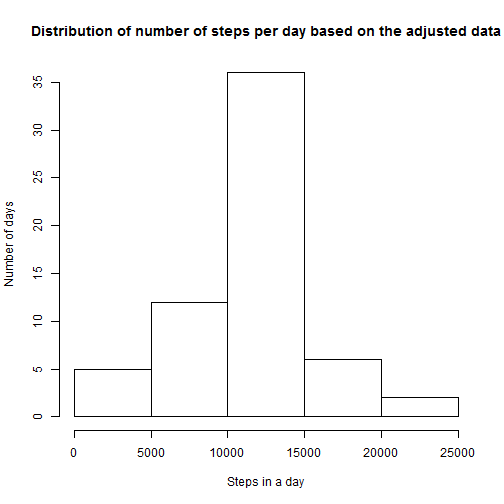

This document is the data analysis report for the Coursera Course 5 Week 2 assignment. The heading numbers are based on the Review Criteria numbers for ease of review.

#1. Code for reading in the dataset and/or processing the data
### Loading and preprocessing the data
  
  
The raw data is loaded and coverted into clean data by formatting the date field

```r
setwd("C:/Users/Lon/Documents/Coursera/Course 5 Reproductible Research/Week 2/RepData_PeerAssessment1")
unzip("activity.zip")
cleandata <- read.csv("activity.csv", header= TRUE, sep= ",", quote= "\"")
cleandata$date <- as.Date(as.character(cleandata$date), "%Y-%m-%d")
head(cleandata)
```

```
##   steps       date interval
## 1    NA 2012-10-01        0
## 2    NA 2012-10-01        5
## 3    NA 2012-10-01       10
## 4    NA 2012-10-01       15
## 5    NA 2012-10-01       20
## 6    NA 2012-10-01       25
```
  <br>
  <br>
  <br>
  
#2. Histogram of the total number of steps taken each day

The code below summarizes the clean data by summing the total number of steps per day.

```r
q2 <- aggregate(cleandata$steps, by= list(cleandata$date), FUN= sum)
colnames(q2) <- c("date", "total.steps")
head(q2)
```

```
##         date total.steps
## 1 2012-10-01          NA
## 2 2012-10-02         126
## 3 2012-10-03       11352
## 4 2012-10-04       12116
## 5 2012-10-05       13294
## 6 2012-10-06       15420
```

```r
hist(q2$total.steps, 
    xlab= "Steps in a day", 
    ylab= "Number of days", 
    main= "Distribution of number of steps per day")
```


  <br>
  <br>
  <br>
  
#3. Mean and median number of steps taken each day
### What is mean total number of steps taken per day?
  
Mean and median steps in a day are summarized below.

```r
mean(q2$total.steps, na.rm= TRUE)
```

```
## [1] 10766.19
```

```r
median(q2$total.steps, na.rm= TRUE)
```

```
## [1] 10765
```
  <br>
  <br>
  <br>
  
#4. Time series plot of the average number of steps taken
### What is the average daily activity pattern?
This question requires us to aggregate the clean data by 5-minute internvals in contrast to the summarized data set above that was aggregated by day.

```r
q4 <- aggregate(cleandata$steps, by= list(cleandata$interval), FUN= mean, na.rm= TRUE)
colnames(q4) <- c("interval", "avg.steps")
head(q4)
```

```
##   interval avg.steps
## 1        0 1.7169811
## 2        5 0.3396226
## 3       10 0.1320755
## 4       15 0.1509434
## 5       20 0.0754717
## 6       25 2.0943396
```

```r
plot(x= q4$interval, 
     y= q4$avg.steps, 
     type= "l", 
     xlab= "Time interval", 
     ylab= "Average steps per day", 
     main= "Average steps per day by time interval")
```


  <br>
  <br>
  <br>
  
#5. The 5-minute interval that, on average, contains the maximum number of steps
### What is the average daily activity pattern?
Find the interval with the highest average number of steps in the day.

```r
q4[ q4$avg.steps==max(q4$avg.steps),]
```

```
##     interval avg.steps
## 104      835  206.1698
```
  <br>
  <br>
  <br>
  
#6. Code to describe and show a strategy for imputing missing data
### Imputing missing values
Missing values in the clean data set is filled in using the average number of steps for the same time interval.

```r
q6 <- cleandata
id <- 1:nrow(q6)
  for(i in id){
    ##checks if there is no step data for a given row
    if(is.na(q6[i,1])) {
      ##looks up the average step value for the interval and adds it to the data set
      q6[i, 1] <- q4[q4$interval == q6[i, 3], 2]  
    }
  }
  
##data set summaries
head(q6)
```

```
##       steps       date interval
## 1 1.7169811 2012-10-01        0
## 2 0.3396226 2012-10-01        5
## 3 0.1320755 2012-10-01       10
## 4 0.1509434 2012-10-01       15
## 5 0.0754717 2012-10-01       20
## 6 2.0943396 2012-10-01       25
```

```r
summary(q6)
```

```
##      steps             date               interval     
##  Min.   :  0.00   Min.   :2012-10-01   Min.   :   0.0  
##  1st Qu.:  0.00   1st Qu.:2012-10-16   1st Qu.: 588.8  
##  Median :  0.00   Median :2012-10-31   Median :1177.5  
##  Mean   : 37.38   Mean   :2012-10-31   Mean   :1177.5  
##  3rd Qu.: 27.00   3rd Qu.:2012-11-15   3rd Qu.:1766.2  
##  Max.   :806.00   Max.   :2012-11-30   Max.   :2355.0
```
  <br>
  <br>
  <br>
  
#7. Histogram of the total number of steps taken each day after missing values are imputed
  
The code below plots the number of days certain step counts are reached based on the adjusted data.

```r
q7 <- aggregate(q6$steps, by= list(q6$date), FUN= sum)
colnames(q7) <- c("date", "total.steps")
head(q7)
```

```
##         date total.steps
## 1 2012-10-01    10766.19
## 2 2012-10-02      126.00
## 3 2012-10-03    11352.00
## 4 2012-10-04    12116.00
## 5 2012-10-05    13294.00
## 6 2012-10-06    15420.00
```

```r
hist(q7$total.steps, 
    xlab= "Steps in a day", 
    ylab= "Number of days", 
    main= "Distribution of number of steps per day based on the adjusted data")
```



```r
mean(q7$total.steps)
```

```
## [1] 10766.19
```

```r
median(q7$total.steps)
```

```
## [1] 10766.19
```
  
  
### Do these values differ from the estimates from the first part of the assignment? What is the impact of imputing missing data on the estimates of the total daily number of steps?
  
The values are very close to the first part of the assignment. The median increased a small amount and now equals the mean. The mean did not change. The overall shape of the historgram did not change, however, there are now more oberservations plotted.
  <br>
  <br>
  <br>
  
#8. Panel plot comparing the average number of steps taken per 5-minute interval across weekdays and weekends
  
Create a new factor to denote weekday and weekends.

```r
q8 <- q6
q8$day <- weekdays(q8$date)
q8$daycat <- ifelse(q8$day %in% c("Saturday", "Sunday"), "Weekend", "Weekday")

##aggregate the data by interval and weekday/weekend split and calculate average steps
q8table <- aggregate(q8$steps, by= list(q8$interval, q8$daycat), FUN= mean)
colnames(q8table) <- c("interval", "daycat", "avg.steps")
head(q8table)
```

```
##   interval  daycat  avg.steps
## 1        0 Weekday 2.25115304
## 2        5 Weekday 0.44528302
## 3       10 Weekday 0.17316562
## 4       15 Weekday 0.19790356
## 5       20 Weekday 0.09895178
## 6       25 Weekday 1.59035639
```

```r
library(lattice)
xyplot(avg.steps ~ interval | daycat, 
       data= q8table, 
       layout= c(1,2), 
       type= "l", 
       xlab= "Interval", 
       ylab= "Number of Steps")
```


  
### Are there differences in activity patterns between weekdays and weekends?
The test subjects on average walked more during the 1000 - 2000 interval during the weekend than compared to weekday.
